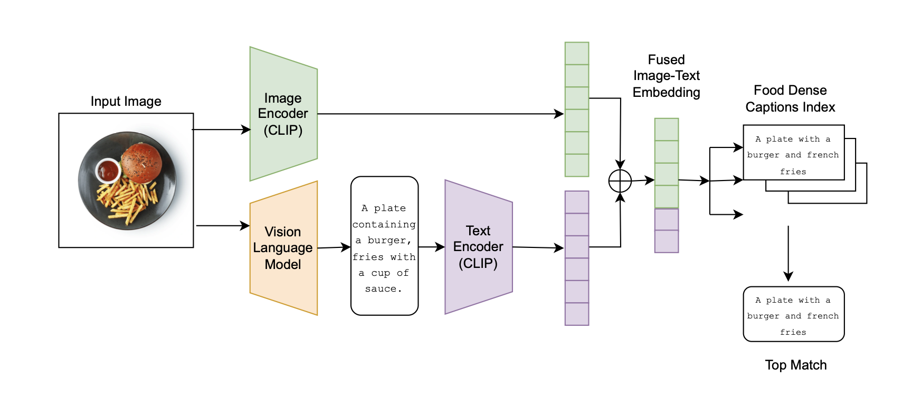
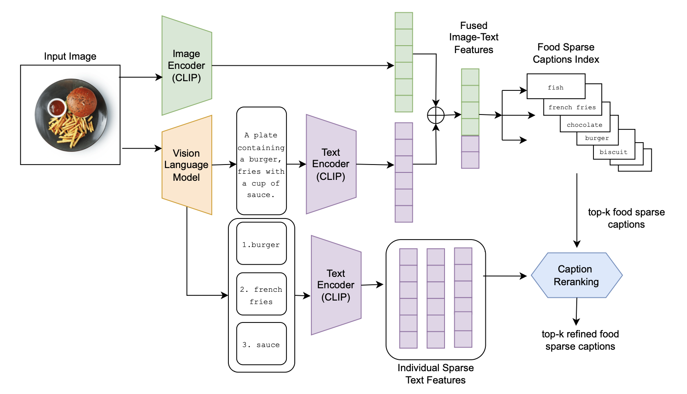
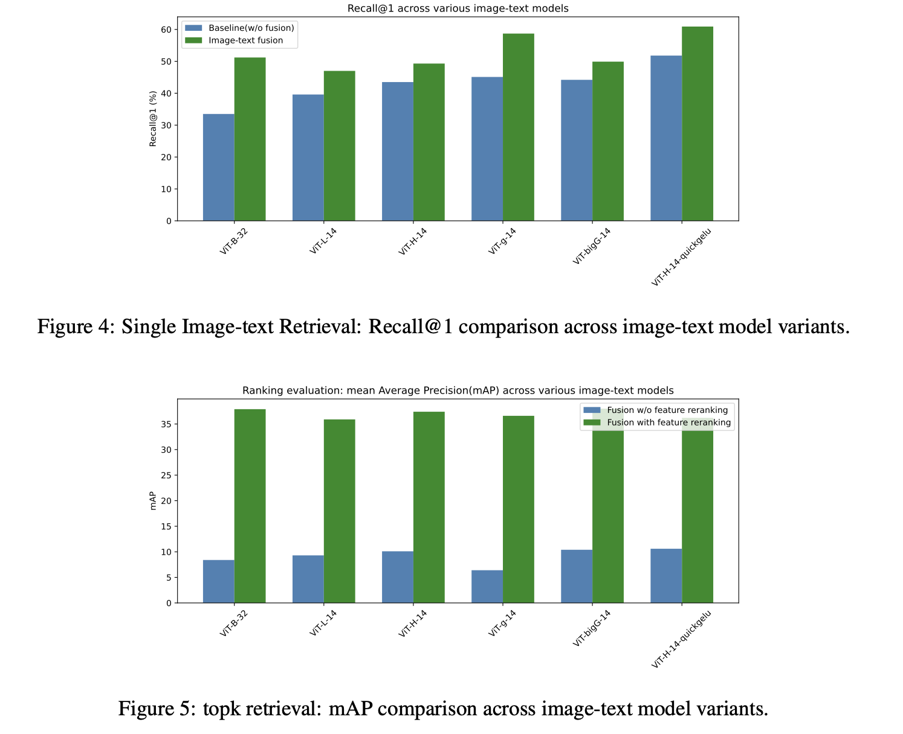
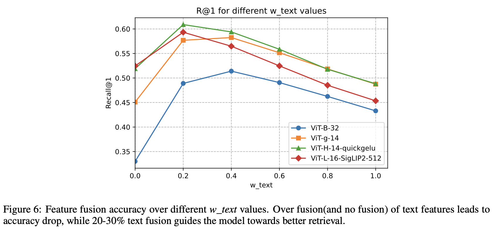

# f4-its
**F4-ITS**: **Fine-grained Feature Fusion for Food Image-Text Search** is a training-free, **vision-language model (VLM)-guided framework** that
significantly improves retrieval performance through enhanced multi-modal feature representations.
Our approach introduces two key contributions: (1) **a uni-directional(and bi-directional) multi-
modal fusion** strategy that combines image embeddings with VLM-generated textual descriptions to
improve query expressiveness, and (2) a novel **feature-based re-ranking mechanism** for top-k retrieval,
leveraging predicted food ingredients to refine results and boost precision.

## Task 1: Single Image-Text Retrieval - Fusion Architecture

## Task 2: topk Retrieval - Fusion + Reranking

## Evaluation Metrics

## F4-ITS Performance under different fusion settings

